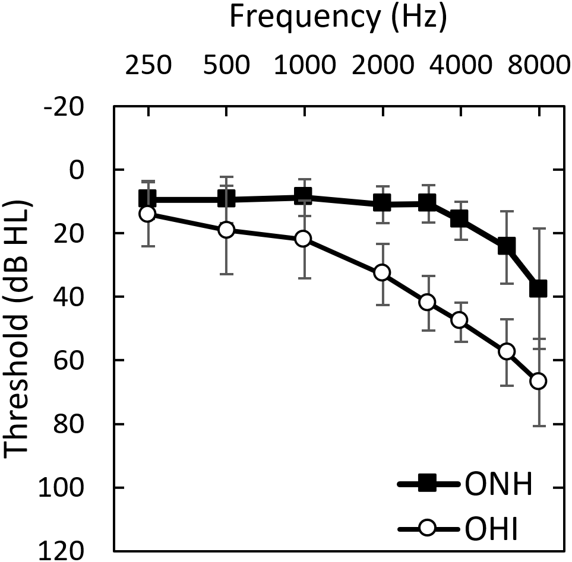
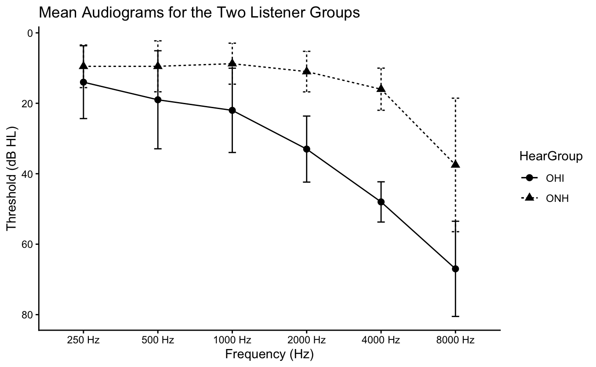
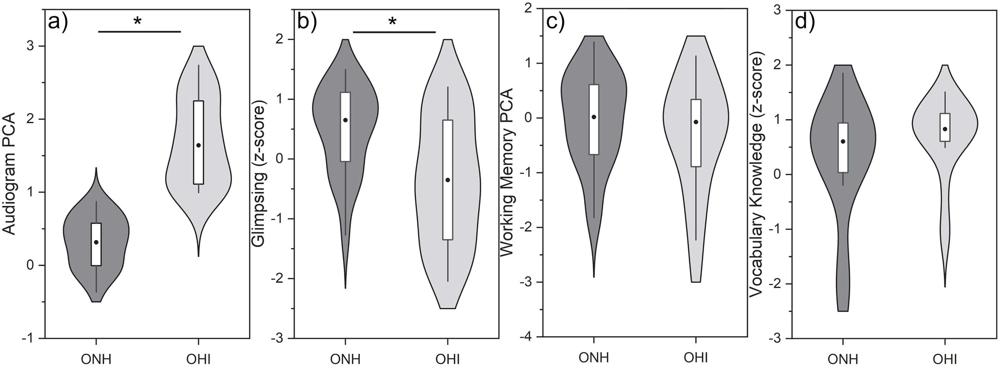
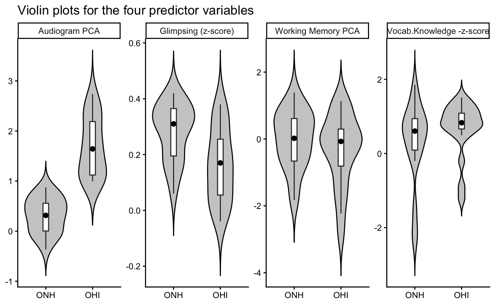

```{r}
knitr::opts_chunk$set(fig.path = "images/")
```

## Introduction

This report presents a replication of selected data analyses from the study "**Auditory and cognitive contributions to recognition of degraded speech in noise: Individual differences among older adults"** by **Daniel Fogerty and Judy R. Dubno.**

This study belongs to the field of auditory neuroscience and speech perception.

The goal of this replication is to reproduce a subset of key statistical findings in the above study using R and to evaluate how closely the replicated results align with those reported in the original study.

## Original Study Overview

#### 1) Goal of the study

-   This study looked at how older adults' auditory and cognitive capacities affect their ability to recognize speech in noisy environments.

-   The study specifically examined individual differences in speech recognition skills between older people with hearing impairment (OHI) and those with. normal hearing (ONH).

-   To understand degraded speech under difficult listening situations, the authors attempted to identify which underlying skills such as hearing sensitivity, working memory, vocabulary knowledge, and speech "glimpsing" ability are most crucial.

#### 2) Data used in the original study

Participants: 40 adults (20 with normal hearing (ONH) and 20 with hearing impairment (OHI))

Predictor variables:

+---------------------------------------------------------------------------------+-------------------------------------------------------------------------------------------+
| **Auditory measures**                                                           | Auditory and Cognitive measures                                                           |
+=================================================================================+===========================================================================================+
| Hearing thresholds                                                              | Tasks assessing working memory, episodic memory, processing speed, and executive function |
+---------------------------------------------------------------------------------+-------------------------------------------------------------------------------------------+
| Speech related processing abilities (modulation detection and speech glimpsing) | Cognitive linguistic measures such as vocabulary knowledge and linguistic closure         |
+---------------------------------------------------------------------------------+-------------------------------------------------------------------------------------------+

Dataset

Three experimental degraded speech conditions were considered.

1.  Spectrally reduced speech

2.  Speech in modulated noise

3.  A combination of both

For each data set above, speech recognition thresholds (SRTs) were calculated at 20%, 50%, and 80% recognition levels. The three datasets described in the original study do not refer to separate data files, but rather to three different experimental speech recognition conditions. These are represented in the dataset by separate outcome variables (D1, D2, D3), each corresponding to a different type of degraded speech condition.

The method used to do that was psychometric functions based on the extended Short-Time Objective Intelligibility (eSTOI). ( This is a mathematical mapping model that relate the objective eSTOI score (a scalar between 0 and 1) to subjective human speech intelligibility scores).

#### 3) Analyses conducted in the original study

Like I mentioned above, the original study looked at the association between predictor variables and speech recognition performance. the statistical methods they used are:

1\) A Principal components analysis (PCA) to generate composite predictor variables and minimize the dimensionality of auditory and cognitive assessments. (The data set after PCA is available for use ready)

2\) After PCA, a summarization of participant characteristics and key predictor variables for the ONH and OHI groups have been done.

2\) A correlational analyses to see which predictors were linked to speech recognition results. A subset of important predictors was chosen for additional examination based on these findings.

3\) A multiple regression dominance analysis to get certain the relative significance of each predictor in explaining variance in speech recognition performance.

-   This analysis was carried out independently for the ONH and OHI groups, as well as for various datasets and task difficulty levels (SRT20, SRT50, and SRT80).

#### 4) Analyses Chosen for Replication

I choose to replicate the following analyses from above except for the initial exploratory data analysis i am going to do.

1.  First, descriptive statistics are used to summarize participant characteristics and key predictor variables for the ONH and OHI groups. I do this analysis using variables of age, gender, hearing sensitivity.

2.  Second, I will create a descriptive visualization is created using violin plots to compare the distributions of key predictor variables between groups, similar to Figure 3 in the original study.

3.  Third, I will conduct an inferential analysis to examine the relationship between predictor variables and speech recognition outcomes, providing a simplified approximation of the dominance analysis used in the original study.I will do a visualization of this analysis too.

4.  Finally, a I will do a correlation analysis is performed to explore relationships between auditory and cognitive predictors and speech recognition performance, and to assess whether similar patterns to those reported in the original study are observed. This will be a second descriptive analysis.

## Variables used in the study

## Data import and initial inspection, visualization of data

The dataset I am going to use for this replication, was obtained from the supporitng information provided with the original paper.

The data file contains participant level measurements auditory and cognitive predictor variables, and speech recognition outcomes.

1\) I will initially inspect the structure of the dataset and the relationships among variables. What I want to show is how these datasets contain large number of variables and why they expected redundancy among them and why it was necessary to first reduce the dimensionality of the data.

```{r}

# Installing and loading the necessary libraries

install.packages("corrplot")
install.packages("combinat")

library(readxl)
library(tidyverse)
library(corrplot)
library(combinat)
```

First I am going to load the data sheets for auditory and cognitive measures in **Table 1. Summary table of experimental measures, including domains, tasks, and variables.** <https://doi.org/10.1371/journal.pone.0331487.t001>

```{r}
auditory_variables <- read_excel("data/journal.pone.0331487.s002.xlsx",sheet = "AuditoryVariables",skip = 1) # Skipping the header above data columns because the auditory dataset contained multi-level headers

cognitive_variables <- read_excel("data/journal.pone.0331487.s002.xlsx",
                        sheet = "CognitiveVariables (z-scores)")
```

First, doing a basic exploration

```{r}
head(auditory_variables)
glimpse(auditory_variables)
```

```{r}
head(cognitive_variables)
glimpse(cognitive_variables)
```

Now I am going to draw some distribution plots for the exploratory data analysis. There are no plots shown for this in the original paper. So I am going to draw.

For auditory variables,

```{r}
auditory_variables_long <- auditory_variables%>%
  pivot_longer(cols = `250 Hz`:`8000 Hz`,
               names_to = "Frequency",
               values_to = "Threshold")

ggplot(auditory_variables_long, aes(x = Threshold)) +
  geom_histogram(bins = 20) +
  facet_wrap(~Frequency, scales = "free") +
  theme_minimal() +
  labs(title = "Distribution of Hearing Thresholds Across Frequencies")
```

Correlations between auditory variables

```{r}
auditory_variables_1 <- auditory_variables %>%
  select(`250 Hz`:`8000 Hz`)

auditory_correlations <- cor(auditory_variables_1)

library(corrplot)
corrplot(auditory_correlations, method = "color", type = "upper")
```

For cognitive variables

```{r}
cognitive_variables_long <- cognitive_variables %>%
  pivot_longer(cols = zShortRecall:zStroop_Mismatch,
               names_to = "Test",
               values_to = "Score")

ggplot(cognitive_variables_long, aes(x = Score)) +
  geom_histogram(bins = 20) +
  facet_wrap(~Test, scales = "free") +
  theme_minimal() +
  labs(title = "Distribution of Cognitive Test Scores")
```

Correlations between cognitive variables

```{r}
cognitive_variables_1 <- cognitive_variables %>%
  select(zShortRecall:zStroop_Mismatch)

cognitive_correlation <- cor(cognitive_variables_1)

# drawing the correlation matrix

corrplot(cognitive_correlation, method = "color", type = "upper")
```

The correlation matrices shows a substantial correlations among variables within both auditory and cognitive domains. In the auditory dataset, hearing thresholds across different frequencies show strong positive correlations, indicating that individuals with elevated thresholds at one frequency tend to show similar patterns across other frequencies. This suggests redundancy in the measurement of hearing sensitivity.

Similarly, in the cognitive dataset, several measures show moderate to strong correlations, particularly among tasks assessing related cognitive functions such as memory and executive control. These patterns indicate that multiple variables may be capturing overlapping underlying constructs.

These findings support the use of principal components analysis (PCA) in the original study, as PCA allows for the reduction of correlated variables into a smaller set of independent components representing underlying auditory and cognitive processes.

The dataset includes principal component (PCA) scores for auditory and cognitive predictors, as well as speech recognition thresholds (SRTs) for multiple datasets. Because PCA variables are already provided, I am not going to recompute PCA, and instead I use these variables directly in the analyses.

## Replication Analysis 1: Descriptive Statistics

### Descriptive Analysis: Participant characteristics

The first descriptive analysis in the original paper focuses on describing the demographic and baseline characteristics of the participants. This includes summarizing age, gender distribution, hearing thresholds, for the two groups: older normal-hearing (ONH) and older hearing-impaired (OHI) listeners.

The goal of this analysis is to replicate the general patterns reported in the original study, such as differences in hearing thresholds between groups and similarities in cognitive abilities.

Now I am loading the correct sheet where the data after doing the PCA., which is named as "Predictors&Outcomes".

```{r}
df <- read_excel(
  "data/journal.pone.0331487.s002.xlsx",
  sheet = "Predictors&Outcomes", ,skip = 1
)
df$HearGroup <- as.factor(df$HearGroup)

```

Summarizing age and sample size.

```{r}
df %>%
  group_by(HearGroup) %>%
  summarise(
    n = n(),
    Age_mean = mean(Age),
    Age_sd = sd(Age),
    Age_min = min(Age),
    Age_max = max(Age)
  )
```

Gender distribution

```{r}
table(df$HearGroup, df$Sex)
```

These above results showes that although the OHI group was slightly older on average, both groups were broadly comparable in age range. The gender distribution also shows a higher proportion of female participants in both groups, with a more balanced distribution in the OHI group.

Key predictor variables : Audiogram_PCA ; Glimpsing ; WorkingMemory_PCA; Vocabulary. The authors have not generated any kind of summarization or any descriptive statistics out of these variables.

But, they have analyzed a,

#### Frequency by frequency mean audiogram from raw audiometric threshold columns like 250Hz, 500Hz, 1000Hz and so on from the "AuditoryVariables" sheet.

So I am trying to replicate that.

for that I need to seperate a dataset that only ha sthe threshold columns.

```{r}

auditory_variables_long <- auditory_variables %>%
  select(HearGroup, `250 Hz`, `500 Hz`, `1000 Hz`, `2000 Hz`, `4000 Hz`, `8000 Hz`) %>%
  pivot_longer(
    cols = `250 Hz`:`8000 Hz`,
    names_to = "Frequency",
    values_to = "Threshold"
  ) %>%
  mutate(
    Frequency = factor(
      Frequency,
      levels = c("250 Hz", "500 Hz", "1000 Hz", "2000 Hz", "4000 Hz", "8000 Hz")
    )
  )

auditory_variables_summary <- auditory_variables_long %>%
  group_by(HearGroup, Frequency) %>%
  summarise(
    mean_threshold = mean(Threshold, na.rm = TRUE),
    sd_threshold = sd(Threshold, na.rm = TRUE),
    .groups = "drop"
  )

auditory_variables_summary
```

Now I can make a scatter kind of plot also using the sd_threshold just like in the original study.

The speciality is when plotting an audiogram we have to make the y axis reverse, because lower thresholds are the better and higher values.

```{r}
ggplot(aud_summary, aes(x = Frequency, y = mean_threshold,
                        group = HearGroup, shape = HearGroup, linetype = HearGroup)) +
  geom_line(color = "black") +
  geom_point(color = "black", size = 2.5) +
  geom_errorbar(
    aes(ymin = mean_threshold - sd_threshold, ymax = mean_threshold + sd_threshold),
    width = 0.1,
    color = "black"
  ) +
  scale_y_reverse() +
  labs(
    title = "Mean Audiograms for the Two Listener Groups",
    x = "Frequency (Hz)",
    y = "Threshold (dB HL)"
  ) +
  theme_classic()
```

### Replication Analysis 2: Descriptive visualization

To visualize a part of the above descriptive statistics, I will try to create the violin plots to compare the distributions of key predictor variables between ONH and OHI groups. The selected variables include:

-   Audiogram PCA (hearing sensitivity) - now not the raw threshold values but value s after PCA
-   Speech glimpsing ability
-   Working memory PCA
-   Vocabulary knowledge

These all values are extracted from the same after PCA data sheet.

To create the violin plots,

```{r}

df$HearGroup <- factor(df$HearGroup, levels = c("ONH", "OHI"))

plot_df <- df %>%
  select(HearGroup, Audiogram_PCA, Glimpsing, WorkingMemory_PCA, Vocabulary) %>%
  pivot_longer(
    cols = c(Audiogram_PCA, Glimpsing, WorkingMemory_PCA, Vocabulary),
    names_to = "Variable",
    values_to = "Value"
  ) %>%
  mutate(
    Variable = factor(
      Variable,
      levels = c("Audiogram_PCA", "Glimpsing", "WorkingMemory_PCA", "Vocabulary"),
      labels = c("Audiogram PCA", "Glimpsing (z-score)", "Working Memory PCA", "Vocab.Knowledge -z-score")
    )
  )

ggplot(plot_df, aes(x = HearGroup, y = Value)) +
  geom_violin(trim = FALSE, fill = "grey80", color = "black") +
  geom_boxplot(width = 0.12, fill = "white", outlier.shape = NA) +
  stat_summary(fun = median, geom = "point", size = 2) +
  facet_wrap(~Variable, scales = "free_y", nrow = 1) +
  labs(
    x = NULL,
    y = NULL,
    title = "Violin plots for the four predictor variables"
  ) +
  theme_classic()
```

### Replication Analysis 3: Inferential analysis: Predictor importance

Now I am going to replicate out of all predictors, which one contributes most to explaining speech recognition. The original study used dominance analysis to determine the relative contribution of the above four predictor variables to speech recognition 

Dominance analysis measures the importance of each predictor variable as defined by the amount of variance accounted for that variable alone and in all possible combinations of the other predictor variables from the linear regression model.This dominance analysis was conducted for each of the nine outcome variables (three SRTs for three datasets). 

so: Examining key predictors: Audiogram PCA, glimpsing, working memory, and vocabulary relate to speech recognition outcomes.

The method they had used were,

-   Multiple regression models were constructed for each dataset and speech recognition threshold (20%, 50%, and 80%). ​

-   The dependent variable was speech recognition performance, and the independent variables were the four predictors.

Thinking about how they calculated the dominance, i saw that it involved calculating the contribution of each predictor variable to the explained variance in the dependent variable individually as well as in combination.Then an average across all predictor subsets. I have to repeat this for all predictors, two groups and across all SRTs and all datasets. So better to write a. function to do this.

This is the most hard part for me in this assignment, because the dominance analysis was a great deal in this study, and was also computationally taking time to do individually one by one.

I totally referred the study they have told which is Humes et al., 2021 - <https://doi.org/10.3389/fnagi.2021.702739>

```{r}

# writing a fucntion to compute the dominance

compute_dominance <- function(data, outcome) {
  
  predictors <- c("Audiogram_PCA", "Glimpsing", 
                  "WorkingMemory_PCA", "Vocabulary")
  # Above are the four predictir variables we are considering
  
  all_subsets <- unlist(
    lapply(1:length(predictors), function(x) {
      combn(predictors, x, simplify = FALSE)
    }),
    recursive = FALSE
  )
  
  # The above step actually is for creating all the combinations of predictor variable subsets.     because the dominance value calculation they did was based on all possible regression      submodels.
  
  results <- data.frame()
  
  # Compute R² for all subsets (every combination) I defined above, and i can store in results data frame.
  
  for (subset in all_subsets) {
    
    formula <- as.formula(
      paste(outcome, "~", paste(subset, collapse = " + "))
    )
    
    model <- lm(formula, data = data) # here is we use the multiple regression models
    
    results <- rbind(results, data.frame(
      Predictors = paste(subset, collapse = ","),
      R2 = summary(model)$r.squared
    ))
  }
  
  # Creating an empty table to store dominance values For each predictor, I will calculate its    average contribution to R² across all possible subsets
  
  dominance <- data.frame(Predictor = predictors, Contribution = 0)
  
  for (pred in predictors) { # I am trying to store calculated contribution values now
    
    contrib_values <- c()
    
    for (subset in all_subsets) {
      
      if (!(pred %in% subset)) next
      
      subset_without <- setdiff(subset, pred) # I remember using this for the wordplay game assignment. I use it here to consider different subsets. 
      
      formula_with <- as.formula(
        paste(outcome, "~", paste(subset, collapse = " + "))
      )
      
      model_with <- lm(formula_with, data = data)
      r2_with <- summary(model_with)$r.squared
      
      if (length(subset_without) == 0) {
        r2_without <- 0
      } else {
        formula_without <- as.formula(
          paste(outcome, "~", paste(subset_without, collapse = " + "))
        )
        model_without <- lm(formula_without, data = data)
        r2_without <- summary(model_without)$r.squared 
      }
      # extracting r2 from each model summary above for predictor subsets with and both without that predictor in the subset
      
      contrib_values <- c(contrib_values, r2_with - r2_without)
    }
    
    dominance$Contribution[dominance$Predictor == pred] <- mean(contrib_values)
  }
  
  return(dominance)
}
```

I want to test this function."D1_SRT50_ESTOI" is one of the SRT columns i have in the dataset, So i will test just for that.its dataset 1, SRT50.

```{r}
df_ONH <- df %>% filter(HearGroup == "ONH")

dom_test <- compute_dominance(df_ONH, "D1_SRT50_ESTOI")

dom_test
```

Looking at the figure 04 of the original study, the calculated values seems to be nearly good.

so, now running for all SRTs and datasets

```{r}
outcomes <- c(
  "D1_SRT20_ESTOI", "D1_SRT50_ESTOI", "D1_SRT80_ESTOI",
  "D2_SRT20_ESTOI", "D2_SRT50_ESTOI", "D2_SRT80_ESTOI",
  "D3_SRT20_ESTOI", "D3_SRT50_ESTOI", "D3_SRT80_ESTOI"
)

run_all <- function(data, group_name) {
  
  results <- data.frame()
  
  for (out in outcomes) {
    
    dom <- compute_dominance(data, out)
    
    dom$Outcome <- out
    dom$Group <- group_name
    
    results <- rbind(results, dom)
  }
  
  return(results)
}

dom_ONH <- run_all(df %>% filter(HearGroup == "ONH"), "ONH")
dom_OHI <- run_all(df %>% filter(HearGroup == "OHI"), "OHI")

dom_all <- rbind(dom_OHI, dom_ONH)
dom_all
```

```{r}
dom_all <- dom_all %>%
  mutate(
    Dataset = substr(Outcome, 1, 2),
    SRT = case_when(
      grepl("20", Outcome) ~ "SRT20",
      grepl("50", Outcome) ~ "SRT50",
      grepl("80", Outcome) ~ "SRT80"
    )
  )
```

Now I am trying to plot, one predictor variable by one.

```{r}
aud_plot <- dom_all %>%
  filter(Predictor == "Audiogram_PCA")

aud_plot$Group <- factor(aud_plot$Group, levels = c("ONH", "OHI"))

ggplot(aud_plot, aes(x = SRT, y = Contribution, fill = Dataset)) +
  geom_col(position = "dodge") +
  facet_wrap(~Group) +
  theme_classic()
```

```{r}

glmp_plot <- dom_all %>%
  filter(Predictor == "Glimpsing")

glmp_plot$Group <- factor(glmp_plot$Group, levels = c("ONH", "OHI"))

ggplot(glmp_plot, aes(x = SRT, y = Contribution, fill = Dataset)) +
  geom_col(position = "dodge") +
  facet_wrap(~Group) +
  theme_classic() +
  labs(title = "Glimpsing")

wm_plot <- dom_all %>%
  filter(Predictor == "WorkingMemory_PCA")

wm_plot$Group <- factor(wm_plot$Group, levels = c("ONH", "OHI"))

ggplot(wm_plot, aes(x = SRT, y = Contribution, fill = Dataset)) +
  geom_col(position = "dodge") +
  facet_wrap(~Group) +
  theme_classic() +
  labs(title = "Working Memory")

voc_plot <- dom_all %>%
  filter(Predictor == "Vocabulary")

voc_plot$Group <- factor(voc_plot$Group, levels = c("ONH", "OHI"))

ggplot(voc_plot, aes(x = SRT, y = Contribution, fill = Dataset)) +
  geom_col(position = "dodge") +
  facet_wrap(~Group) +
  theme_classic() +
  labs(title = "Vocabulary Knowledge")
```

### Replication Analysis 4: Second Descriptive Analysis: Correlation Analysis

Finally, I do a correlation analysis to examine relationships between predictor variables and speech recognition outcomes. This is different from the initial correlation analysis I did in initial data visualzation, this analysis os predictor variables vs the SRTs, not between each predictor variables.

This analysis aims to replicate patterns reported in the original study, they have used not only above 4 variables but all below.

Auditory-related PCA variables: Audiogram_PCA, SpeechModulation_PCA, EpisodicMemory_PCA, Interference_PCA Cognitive:WorkingMemory_PCA, Vocabulary, LinguisticClosure, Glimpsing

going through all coulmns related:

```{r}
df$HearGroup <- factor(df$HearGroup, levels = c("ONH", "OHI"))

# predictor variables used in the paper
predictor_vars <- c(
  "Audiogram_PCA",
  "SpeechModulation_PCA",
  "WorkingMemory_PCA",
  "EpisodicMemory_PCA",
  "Interference_PCA",
  "Vocabulary",
  "LinguisticClosure",
  "Glimpsing"
)

# all experimental speech outcome variables
outcome_vars <- c(
  "D1_SRT20_ESTOI", "D1_SRT50_ESTOI", "D1_SRT80_ESTOI",
  "D2_SRT20_ESTOI", "D2_SRT50_ESTOI", "D2_SRT80_ESTOI",
  "D3_SRT20_ESTOI", "D3_SRT50_ESTOI", "D3_SRT80_ESTOI",
  "Overall_PCA (Experimental)"
)
```

If I type individually for all 3 SRTs and across three datasets this will be a long code, so making a function to do so,

```{r}
get_cor_table <- function(data, predictors, outcomes, group_name) {
  
  results <- data.frame()
  
  for (pred in predictors) {
    for (out in outcomes) {
      
      r_value <- cor(data[[pred]], data[[out]], use = "complete.obs")
      
      results <- rbind(
        results,
        data.frame(
          Group = group_name,
          Predictor = pred,
          Outcome = out,
          Correlation = r_value
        )
      )
    }
  }
  
  return(results)
}

```

```{r}
cor_onh <- get_cor_table(
  data = df %>% filter(HearGroup == "ONH"),
  predictors = predictor_vars,
  outcomes = outcome_vars,
  group_name = "ONH"
)

cor_ohi <- get_cor_table(
  data = df %>% filter(HearGroup == "OHI"),
  predictors = predictor_vars,
  outcomes = outcome_vars,
  group_name = "OHI"
)

cor_all <- bind_rows(cor_onh, cor_ohi)

head(cor_all)
```

Since I need to see the whole table to compare it with the results from their study,

```{r}
cor_table_wide <- cor_all %>%
  pivot_wider(
    names_from = Outcome,
    values_from = Correlation
  )

cor_table_wide
```

## Discussion and Reflection

### 1) Comparison to the Original Paper

### [Comparison of Analysis 1: Descriptive Statistics]{.underline}

1\) The descriptive statistics obtained in this part closely match with the patterns reported in the original study.

+---------------------------------------------------------------------------------------------------------------------------------------------------------------------------------------------------------+-------------------------------------------------------------------------------------------------------------------------------------------------------------------------------------------------------------------------------------------------+
| #### Reported participant characteristics in the Original Study                                                                                                                                         | #### Replicated results                                                                                                                                                                                                                         |
+=========================================================================================================================================================================================================+=================================================================================================================================================================================================================================================+
| The original study reported that the ONH group had a mean age of approximately 67 years (range: 60–74 years), while the OHI group had a higher mean age of approximately 72 years (range: 60–85 years). | The replicated results using their provided dataset showed a mean age of 67.4 years for the ONH group and 72.2 years for the OHI group.[Replication Analysis 1: Descriptive Statistics]                                                         |
+---------------------------------------------------------------------------------------------------------------------------------------------------------------------------------------------------------+-------------------------------------------------------------------------------------------------------------------------------------------------------------------------------------------------------------------------------------------------+
| In terms of gender distribution, the ONH group consisted of 17 females and 3 males, whereas the OHI group included 13 females and 7 males.                                                              | The replication showed gender distribution is also identical to that reported in the original study, with 17 females and 3 males in the ONH group, and 13 females and 7 males in the OHI group.[Replication Analysis 1: Descriptive Statistics] |
+---------------------------------------------------------------------------------------------------------------------------------------------------------------------------------------------------------+-------------------------------------------------------------------------------------------------------------------------------------------------------------------------------------------------------------------------------------------------+

: Comparison of Analysis 1: Descriptive Statistics

**These results indicate that the descriptive statistics for participant characteristics were successfully replicated with no discrepancies.**

2\) The audiogram visualization also successfully replicates the main pattern shown in Fig. 1 of the original study.[Frequency by frequency mean audiogram from raw audiometric threshold columns like 250Hz, 500Hz, 1000Hz and so on from the "AuditoryVariables" sheet.]

#### Original Study - **Fig 1. Mean audiograms for the two listener groups** 

{width="400"}

#### Replicated mean audiogram values for the two groups

{width="500"}

**The audiogram visualization also successfully replicates the main pattern shown in Fig. 1 of the original study. In both the original and replicated figures, the OHI group shows elevated hearing thresholds across frequencies compared to the ONH group, with the largest differences at higher frequencies. The overall shape and trend of the curves are highly consistent between the two figures.**

no specific challenges were faced in this section, because the column names were clear in the data set in what to choose other than the additional preprocessing required for handling multi level headers in the auditory variables data sheet.

### [Comparison of Analysis 2: Descriptive visualization]{.underline}

The original study used violin plots (Fig. 3) to compare the distributions of four key predictor variables between ONH and OHI groups: Audiogram PCA, speech glimpsing, Working Memory PCA, and vocabulary knowledge.

#### Original Study - **Fig 3.** Violin plots for the four predictor variables



#### Replicated figure

The replicated violin plots show very similar patterns.



### Challenges I faced

-   One of the main issues was related to the structure of the dataset, particularly the presence of multi level headers in the auditory variables sheet. This required additional preprocessing steps before analysis could be performed.

-   Another challenge was identifying which variables corresponded directly to those used in the original study. For example, the study reports PCA derived variables, but the dataset also includes raw variables.

------------------------------------------------------------------------

### Reasons for These Challenges

These challenges primarily arose due to limited detail in the original study regarding data preprocessing steps. The paper does not explicitly describe how the raw data were structured or how variables were named in the shared dataset. Additionally, the transformation from raw variables to PCA components was described conceptually but not operationally, making it difficult to trace the exact steps taken.

------------------------------------------------------------------------

### Missing Details in the Original Study

Some methodological details that would have improved reproducibility include:

-   A clearer description of the dataset structure (e.g., sheet organization and column naming)
-   Explicit mapping between raw variables and derived PCA variables
-   Details on preprocessing steps such as handling missing values or variable scaling
-   Exact plotting parameters used for figures (e.g., axis scaling, smoothing, and error bar computation)

The absence of these details required additional interpretation and assumptions during the replication process, which may introduce small differences between the original and replicated results.

### 

## how successful were you at replicating the analyses and visualizations in the study. What problems did you encounter? Why might you have encountered those problems? What details were lacking from the original study's methods that might have hampered your ability to replicate the authors' results?

## 

## References

Dominance analysis - Humes et al. 2021 - <https://doi.org/10.3389/fnagi.2021.702739>
